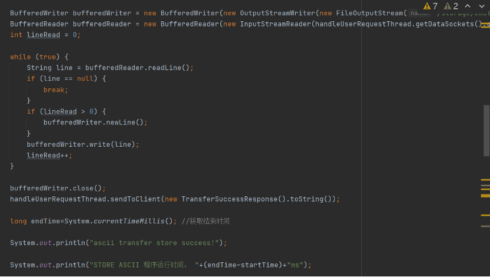

# Project1 FTP实验文档

学号：19302010081	姓名：夏梦洁

学号：19302010080	姓名：徐清霞

贡献占比50%：50%

[TOC]


## 优化策略

### 1.用两个数据连接再合并

使用两个数据连接，传文件的前一半时用一个数据连接，后一半再打开一个数据连接进行传输。

这里只讨论binary模式下的优化。


首先新建立两个数据连接如下


将while内的循环条件改为文件的size大小1/2，用两个socket同时读取。其中第一个socket数据连接读取文件开头到文件size的二分之一，第二个socket读取的位置为文件size的二分之一到文件末尾。

第一个socket用来读取完文件的前二分之一的size之后，第二个socket则用来读取文件的后半部分，实现并行读取的效果。

在读取完毕之后，调用closeAllConnection方法，关闭所有连接。


> 但是我们尝试了这种方法后，发现传输时间不减反增。这与很多因素有关，可能是文件还不够大，也可能是网络的本身传输的限制，所以我们最后没有采用这种优化策略。

### 2.采用持久化连接

我们在代码中设置了一个决定是否保持持久化的变量。


变量值为false，在store和retr中，则首先判断是否需要建立连接。

1.若为非持久化连接，即变量值为false，则必须建立数据连接，若建立成功则开始传输文件，若建立失败则给客户端返回一个建立失败的状态码，return。

2.若为持久化连接，即变量值为true，则首先判断是否已经有数据连接，若已经存在则给客户端返回已经建立连接的状态码，若数据连接的List仍然为空且为持久化连接则建立新的数据连接，判断建立成功则开始传输文件，若建立失败则给客户端返回一个建立失败的状态码，return。

3.若以上两种情况均不满足，则说明已经有数据连接，返回对应的状态码后开始对应的上传or下载流程。

判断是否需要关闭数据连接：


1.若为非持久化连接，则无论如何都关闭对应的数据连接。

2.若为持久化连接，则变量值为true，在用户未请求的情况下不需要关闭数据连接，保持打开的状态，这样可以节约关闭再打开的时间。


## client

### FTPCIient类

最核心的部分是FTPClient类，这个类中实现了客户端向服务器端发送指令、读取指令的基本操作。各指令的具体实现如下：

#### `USER`和`PASS`


```java
/**
     * 实现用户登陆
     * @param username 用户输入的用户名
     * @param password 用户输入的密码
     * @return 返回用户是否登陆成功
     */
public boolean login(String username, String password) throws IOException, ClientException {
        // 写USER指令 USER <SP> <username> <CRLF>
        writeCommand(String.format("USER %s", username));
        // 读取响应
        String response = commandSocketReader.readLine();
        Log.d("debug1", response);
        // 状态码是230，说明该用户是没有密码的，登陆成功
        if (response.startsWith("230")) {
            return true;

        }
        // 用户名正确，需要输入密码
        else if (response.startsWith("331")) {
            // 写密码指令 PASS <SP> <password> <CRLF>
            writeCommand(String.format("PASS %s", password));
            response = commandSocketReader.readLine();
            Log.d("debug1", response);
            // 状态码是230就是登陆成功
            if (response.startsWith("230")) {
                return true;
            } else {
                return false;
            }
        }
        else {
            return false;
        }
    }
```

#### `MODE`  \ `Type` \ `STRU`

这三个指令分别是设置mode、type、stru的指令，实现方法类似，故在此只展示mode的实现

```java
public enum Mode {
        S,  //Stream（流，默认值）
        B,  //Block（块）
        C   //Compressed（经过压缩）
    }
    // 默认为Stream模式
    private volatile Mode mode = Mode.S;

public synchronized void setMode(Mode mode) throws IOException, ClientException {
        String arg = "";
        if (mode == Mode.S) {
            arg = "S";
        } else if (mode == Mode.B) {
            arg = "B";
        } else if (mode == Mode.C) {
            arg = "C";
        }
        String line = String.format("MODE %s", arg);
        Log.d("debug1", "向服务器发送MODE指令");
        writeCommand(line);
        String response = commandSocketReader.readLine();
        Log.d("debug1", response);
        if (response != null && response.startsWith("200")) {
            this.mode = mode;
        }
        else {
            throw new ClientException(response);
        }
    }
```

#### `PASV`

被动模式，向服务器发送`PASV <CRLF>`指令，并读取到服务器返回到IP地址和端口号，从而进行数据连接。

#### `PORT`

主动模式，向服务器发送`PORT %s,%d,%d`指令，第一个String代表着IP地址，数字之间用逗号分隔开，后面两个数是随机生成的小于256的整数，表示随机生成的端口号

#### `LIST`

客户端向服务器发送`LIST path`指令，获得服务器路径为path的文件夹下的所有子文件，以完成展示服务器上文件的功能

```java
/**
     *向服务器发送LIST指令，获取文件夹内的文件
     * @param folderName 想获取到到文件夹的路径
     * @return 返回文件中子文件名的List
     * @throws IOException
     * @throws ClientException
     */
    public synchronized List<String> list(String folderName) throws IOException, ClientException {
        String line = String.format("LIST %s", folderName);
        Log.d("debug1", "向服务器发送LIST指令");
        Log.d("debug1", line);
        writeCommand(line);
        String response = commandSocketReader.readLine();
        Log.d("debug1", response);
        if (response == null || !response.startsWith("200")) {
            throw new ClientException(response);
        }
        List<String> filenameList = new ArrayList<>();

        while (true) {
            String filenameInfo = commandSocketReader.readLine();
            if (filenameInfo == null || filenameInfo.length() == 0) {
                break;
            }
            filenameList.add(filenameInfo);
        }
        return filenameList;
    }
```

#### `STOR`

客户端向服务器端上传文件


####  `RETR`

与STOR相似，成功：200（指令正确）-->125（数据连接成功）-->226文件传输成功

这里值得一提的是，为了优化传输速度，我们采用了持久化连接的策略，所以在STOR和RETR的数据连接中，先要判断是否为持久化连接，有两种情况需要重建数据连接（如下代码所示）,而在持久化连接且已经建立过数据连接的情况下，传输成功之后不用对数据连接的socket进行注销，在下一次的传输中也不用重新建立数据连接

```java
				// 以下两种情况要进行数据连接
        // 1.不是持久化数据连接 2.持久化数据连接但是从来没有过数据连接
        if (!keepConnected || (keepConnected && dataSocket == null)) {
            //建立数据连接
            boolean success = dataConnect();
            if (!success) {
                Log.d("debug1", "建立数据连接失败");
                throw new ClientException("建立数据连接失败");
            }
        }
```

这里的dataConnect()方法，需要检验当前是主动还是被动模式，并作出相应的数据连接操作

```java
public boolean dataConnect() throws IOException {
        // 如果已经有了数据连接，先关闭
        if (dataSocket != null) {
            dataSocket.close();
        }

        //如果是主动模式，由客户端来生成port,服务器来连接
        if (passiveOrActive == PassiveOrActive.ACTIVE) {
            this.dataSocket = serverSocket.accept();
            return true;
        }
        // 如果是被动模式
        else {
            this.dataSocket = new Socket(address, port);
            return true;
        }
    }
```


### FTPUtil类

其中有静态成员`ftpClient`和静态方法`getFtpClient()`，用于在多个activity中调用获取FTPClient对象

```java
public class FTPUtil {
    private static String hostname;
    private static int port = 21;// 端口号默认是21
    private static boolean connect;
    private static String username;
    private static String password;
    private static FTPClient ftpClient;

    public static void init(String hostname1, int port1, String username1, String password1) throws IOException, ClientException {
        hostname = hostname1;
        port = port1;
        username = username1;
        password = password1;
        if (ftpClient == null) {
            ftpClient = new FTPClient(hostname1, port1);
        }


    }

    public static FTPClient getFtpClient() {
        return ftpClient;
    }
}
```


### FTPFile类

由于`LIST`指令下，服务器端向客户端返回的只是一个String的List，并不是真正的文件。所以我们构建了一个类似于File的FTPClient类，重现了File类中的`isDirectory()`、`listFile()`、`getParentFile()`等方法，也实现了传入path或name的构造方法


### FTPFileAdapter类和FileAdapter类

我们面临这样一个问题：因为服务器的文件是用FTPFile类表示的，而本地的文件是用File表示的。这样我们主活动上用于显示文件列表的Recyclerview就不能用一个适配器来解决了。因为这个两各类没有父子关系和亦或是同一个接口或者父类的子类关系。我的解决方法是：既然不能用一个适配器那就写两个适配器，在需要在服务器文件列表和本地文件列表之间切换时，主活动的recyclerview就使用setAdapter()进行切换。这样就像一个插口一样既可以插这个适配器，又可以插那个适配器。

在这两个适配器中，都实现了点击、长按、上传\下载、返回等事件的处理


### ConnectionActivity

在这个文件中实现了与服务器连接的界面，界面如图所示


点击匿名登陆的switch按钮，就是匿名登陆，用户名自动填充为anonymous。


### FileListActivity类

展示文件的activity，右上角的菜单可以设置Mode\Type\STRU\主动被动\快传等


左上角的菜单可以设置目录的转换


1. ## 优化策略

   使用两个数据连接，传文件的前一半时用一个数据连接，后一半再打开一个数据连接进行传输。

   这里只讨论binary模式下的优化。

   

   首先新建立两个数据连接如下

   

   将while内的循环条件改为文件的size大小1/2，用两个socket同时读取。其中第一个socket数据连接读取文件开头到文件size的二分之一，第二个socket读取的位置为文件size的二分之一到文件末尾。

   第一个socket用来读取完文件的前二分之一的size之后，第二个socket则用来读取文件的后半部分，实现并行读取的效果。

   在读取完毕之后，调用closeAllConnection方法，关闭所有连接。

   


## server

FTP SEVER：

### USER：判断用户名密码是否有效，只有两个用户

1.  匿名用户
2.  有用户名和密码的用户


### PASS：若不是匿名用户，则检验密码是否正确


### LIST：列出一个文件夹下的文件夹路径和文件路径

文件夹中的不需要列出


### PORT主动模式：

收到主动模式的PORT请求之后，判断：

1. 用户是否登录

   

2. 传来的IP地址和两个number是否符合请求

   

3. 若以上条件均符合要求，则将模式设为主动模式，记录客户端传过来的IP地址和端口。

   

   ### PASV被动模式：

1. 判断用户是否登录

   

2. 给用户返回本手机的IP和一个端口号

   

   QUIT退出：

   

   

   ### TYPE：设置ASCII或者BINARY模式

1. 判断是否登录

   

2. 设置ASCII或者BINARY模式

   

   ### MODE：设置模式

   始终返回200.

   ### RETR：服务器向客户端传文件

   1.ASCII模式

   

   2.BINARY模式

   

   ### STOR：客户端向服务器传文件

   若目录不存在，则先创建目录

   

   1.ASCII模式

   

   2.BINARY模式

   

   ### KEEP类：

   接受客户端的命令，

   

   
